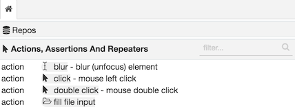
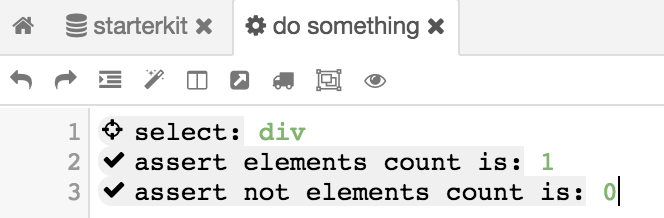
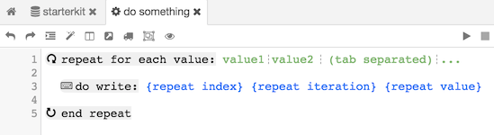

# Actions, Assertions And Repeaters

The lowest level of units in Testissimo code are actions. There are three types of actions: 
1. Actions - user simulation actions, such as click, keypress, etc...
2. Assertions - value assertions, which will throw an exception if not pass, such as. assert elements count or current url
3. Repeaters - repeats a block of code inside the repeater

## List Of All Available Actions

## Actions (User Simulation) - use "do" prefix

Actions are pretty straightforward, there is no need to describe them standalone. They often need elements selection before, because they are simulating user interaction with none, one or many HTML elements.

## Assertions - use "assert" prefix

Assertions check some part of the current state. They are crucial for testing, you should assert any important state change, e.g. if you write text in HTML input, you should check if the value in the input is correct. Because if HTML input has some mask (phone, email, etc...), it can discard value and be blank again. If an assertion doesn't pass it will stop the test and throw an exception.

For negative assertion, add "not" after prefix, e.g. "assert **not** elements count is: 1"

## Repeaters - use "repeat" prefix

Repeaters are blocks. It means they have start and end, and inside can be some other code, or another repeater. Currently, there is one type of repeat "for each value" in the collection of values, by default tab-separated. Inside block there are three very useful variables:

1. repeat index - iteration index from zero
2. repeat iteration - iteration order, same as index, but starting with 1
3. repeat value - current iteration value

