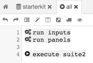

# Test Suites

Test Suites are nothing else than groups or lists of tests to organize test run. They are very useful when running headless. A test suite can be run from another test suite, just use "execute" prefix.

